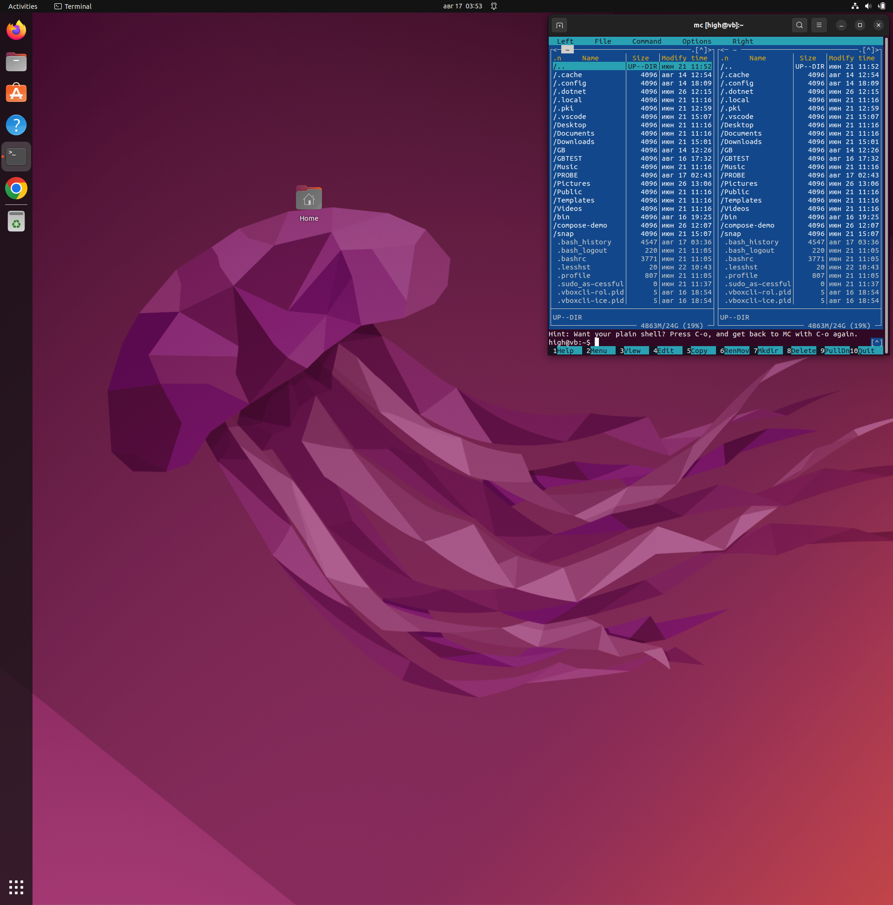
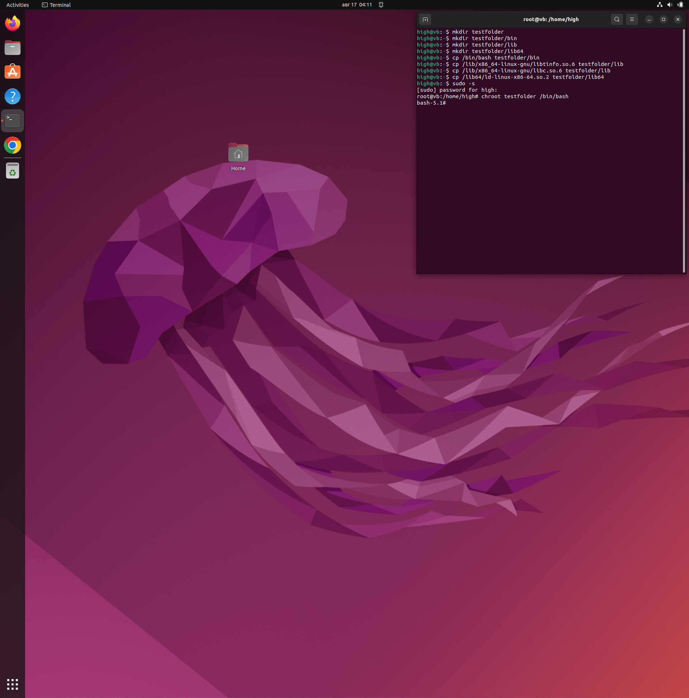
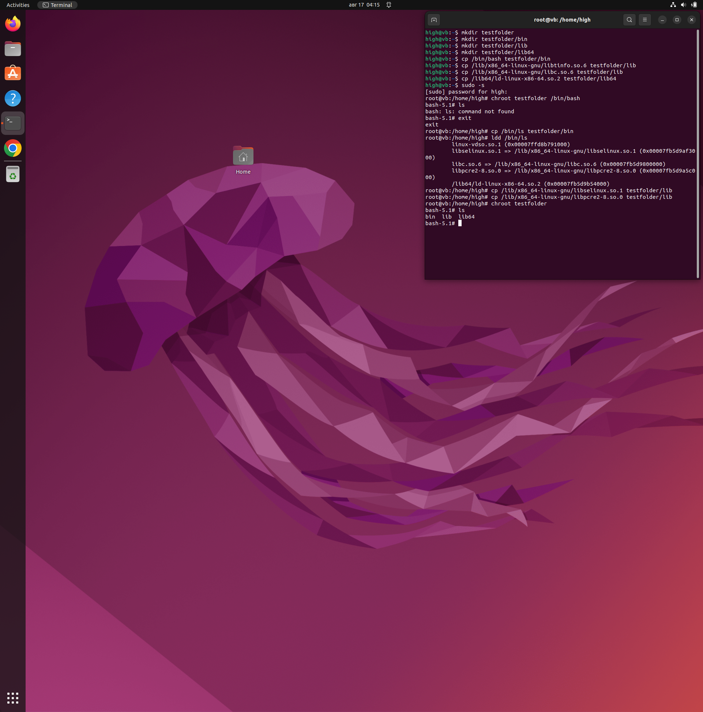
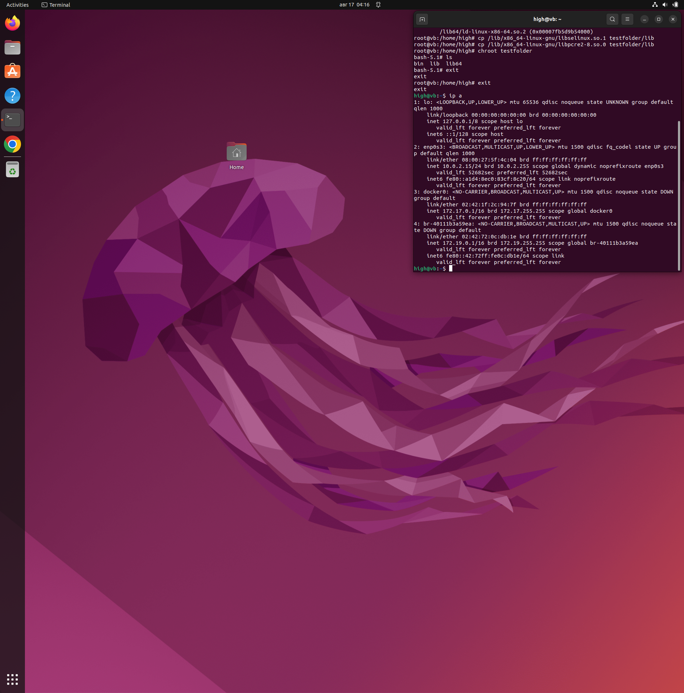
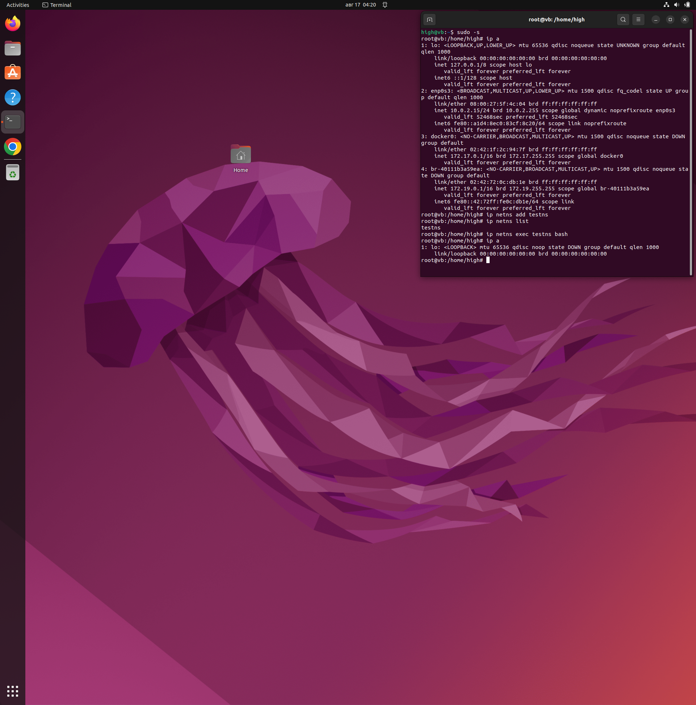
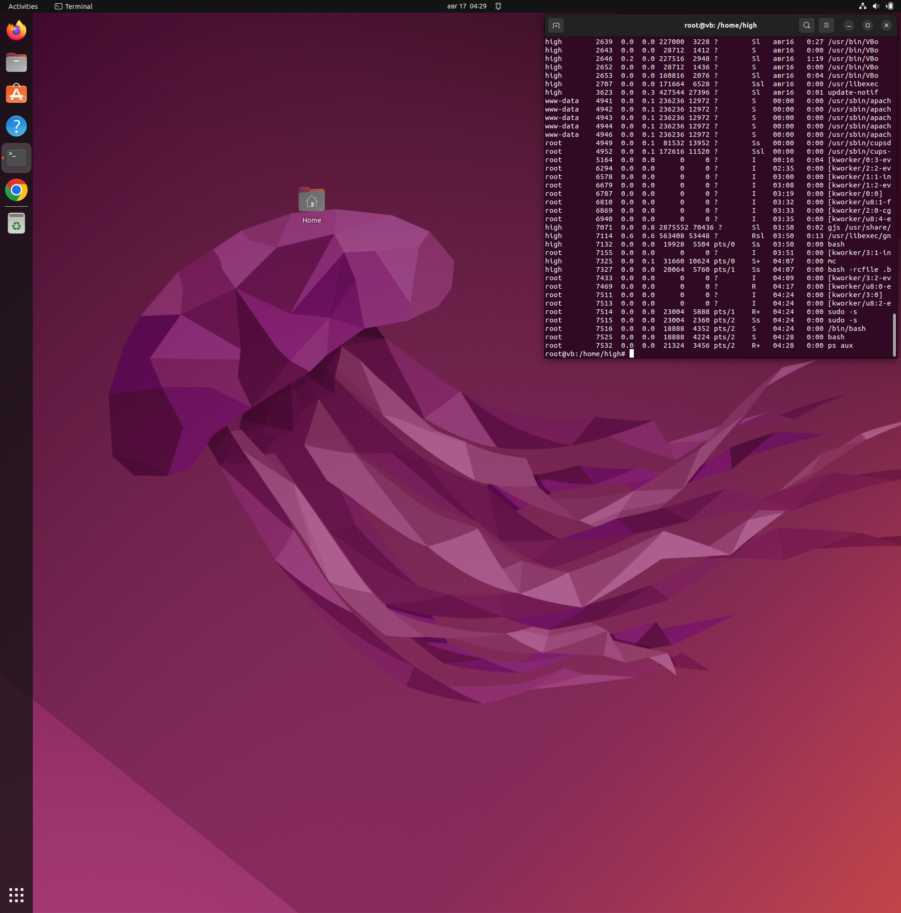

# Контейнеризация (семинар 01)
Демонстрация изоляции приложения в различных пространствах имен.
## chroot
Вызов `chroot` на практике.
Для этого создадим каталог "testfolder" в домашнем каталоге пользователя и запустим команду `chroot`.

Создаем директорию "testfolder":

`mkdir testfolder`

Копируем исполняемый файл командного интерпретатора /bin/bash в папку "testfolder/bin":

`mkdir testfolder/bin`

`cp /bin/bash testfolder/bin`

Создаем необходимые директории "testfolder/lib" и "testfolder/lib64":

`mkdir testfolder/lib`

`mkdir testfolder/lib64`

Копируем необходимые библиотеки в папку "testfolder/lib" и "testfolder/lib64".

`cp /lib/x86_64-linux-gnu/libtinfo.so.6 testfolder/lib`

`cp /lib/x86_64-linux-gnu/libc.so.6 testfolder/lib`

`cp /lib64/ld-linux-x86-64.so.2 testfolder/lib64/`

Запускаем команду `chroot` для изменения корневой папки:

`chroot testfolder /bin/bash`

### Старт

### bash запущен с помощью `chroot`

Оболочка bash — работает. 

Пробуем:

`ls`

получаем:

`bash: ls: command not found`

То есть текущая система не видит файлов, ответственных за исполнение команды.

Дополняем образ системы:

`cp /bin/ls testfolder/bin/`

`ldd /bin/ls`

`cp /lib/x86_64-linux-gnu/libselinux.so.1 testfolder/lib/`

`cp /lib/x86_64-linux-gnu/libpcre2-8.so.0 testfolder/lib/`

`chroot testfolder/`

`ls`

Теперь у нас есть команда `ls`.

### Запуск `ls` 

### Итоги по `chroot`

Создавая новую корневую систему командой `chroot`, нам потребуется дублировать все исполняемые файлы, так как система изначально пуста. Это ведет к увеличению занимаемого дискового пространства и усложняет настройку машины.

## Сетевое пространство имен

Пространство имен в системе Линукс, абстракция в которой находятся все системные ресурсы. Тип ресурса зависит от типа Пространства имен. Пространство имен это не дополнительная функция которую можно установить или обойтись без нее. Это сущность которая изначально предоставляется самим ядром ОС и является необходимым компонентом, который принимает участие в процедуре запуска абсолютно любого процесса в системе. И в любой момент времени, любой процесс может принадлежать только одному Пространству имен каждого типа. Так же Пространство имен это механизм который обеспечивает изоляцию процессов друг от друга в Юникс Системемах.

### Старт. Введена команда `ip a`

Добавляем новое Пространство имен:

`ip netns add testns`

Запускаем оболочку:

`ip netns exec testns bash`

Смотрим текущее состояние системы:

`ip a`

### Введена команда `ip a`. Доступен один интерфейс

При этом мы остаемся в своей хостовой системе. Смотрим процессы:

`ps aux`

### Введена команда `ps aux`

## Утилита `unshare`

Для дополнительного ограничения системы можно использовать утилиту `unshare`. Она позволяет разграничивать доступ с помощью следующих ключей:

`--net` — ограничевает сетевое пространство имен

`--mount-proc` — разграничивает процессы

`--fork` — изолирует память

`--pid` — изолирует дерево процессов

Введена команда `unshare --net --pid --fork --mount-proc /bin/bash`

### Список процессов после ввода `unshare`

### Вывод директорий, файлов и списка процессов после запуска `unshare`

