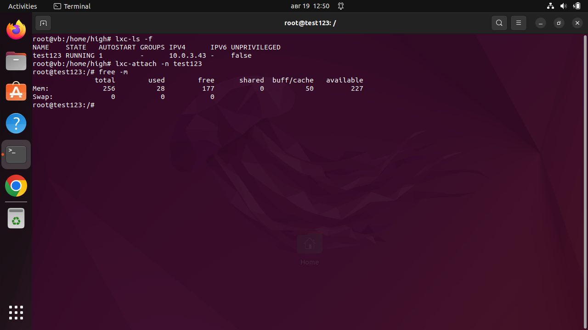

# Контейнеризация (семинар 02)
Создание и запуск контейнера, с использованием механизма LXC.
## LXC
В системе работаем под правами `root`.
Устанавливаем пакет LXC:

`apt install lxd-installer`

`apt install lxc-utils`

## Создание и запуск контейнера
Создаем контейнер:

`lxc-create -n test123 -t ubuntu`

Запускаем контейнер:

`lxc-start -n test123`

Останавливаем контейнер:

`lxc-stop -n test123`

## Ограничение памяти и автозапуск контейнера
Для настройки контейнера редактируем `/var/lib/lxc/test123/config`, добавляя в него строки:

`lxc.cgroup2.memory.max = 256M`

`lxc.start.auto = 1`

После перезагрузки (работаем по-прежнему под правами `root`) убеждаемся в автостарте контейнера.

Подключаемся к контейнеру командой 

`lxc-attach -n test123`

Выводим объем доступной для контейнера памяти:

`free -m`

## Логи
Для ведения логов — останавливаем контейнер, и перезапускаем его командой:

`lxc-start -d -n test123 -l debug -o test.log`

Далее, по команде

`cat test.log`

получаем «простыню» логов для последующего анализа.

