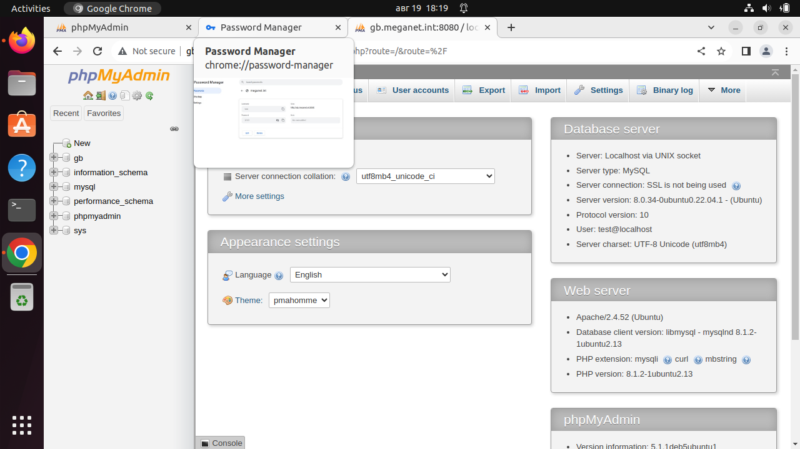
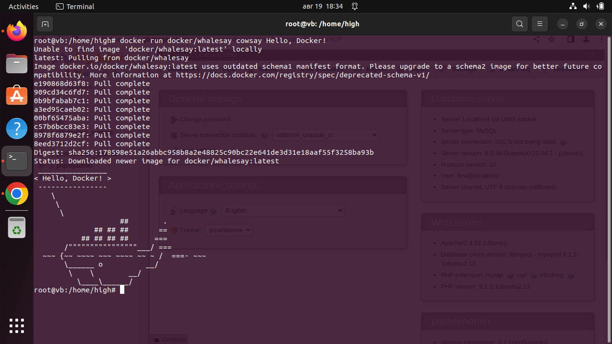
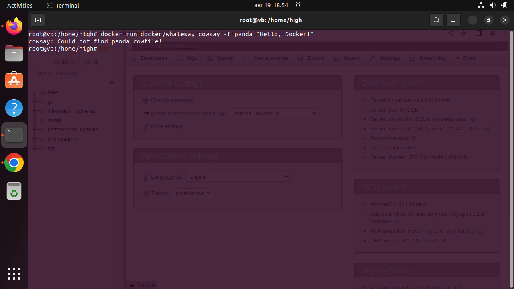
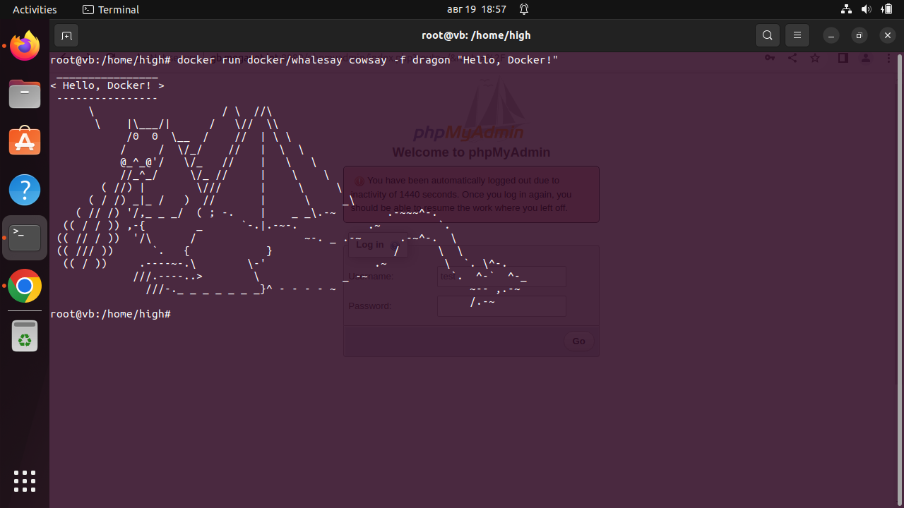
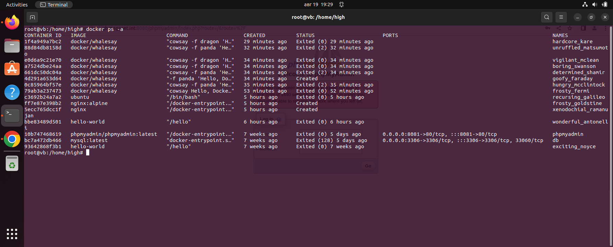

# Контейнеризация (семинар 03)
Начало работы с пакетом Docker.

(Всем привет. Я действую в рамках курса обучения, но это уже второе пришествие в тему: первое было — курс «Виртуализация». Там уже работали с докерами и прочими портовыми грузчиками. Оттуда и есть на моей виртуальной машине проброс через NGINX пакетов до Apache, с подключенным к этому комплексу системы SQL и PHP. Пакет `docker` у меня установлен и работает, поэтому я не собираюсь чинить то, что не сломалось. Машина работает. На скринах ниже — это будет показано.)

## Docker
Установка пакета в систему тривиальна. Не буду вдаваться в подробности. Ищем в сети. Хорошее место:

<https://www.digitalocean.com/community/tutorials/how-to-install-and-use-docker-on-ubuntu-20-04-ru>

Или все любое, что вам будет удобнее.

## Тест
Цитата:
> «В данном примере используется образ "docker/whalesay", который содержит утилиту "cowsay". Он будет выводить на экран сообщение "Hello, Docker!" с помощью рисунка коровы.»

`docker run docker/whalesay cowsay Hello, Docker!`

Несколько несогласен с приведенной выше цитатой. Слово «whalesay» как бэ говорит нам, что ~~Король говорит~~ говорит кит. И тогда со скриншотом — все хорошо:

Кит приветствует докера! Ура!!!

Однако, корова из команды куда-то потонула. Нас приветствует только чудо-юдо — рыба-кит. 

8—|

К сожалению, панду вызвать не удалось:

`docker run docker/whalesay cowsay -f panda "Hello, Docker!"`

Однако, дракон — на посту:

`docker run docker/whalesay cowsay -f dragon "Hello, Docker!"`

## Хранение данных
Данные, относящиеся только к конкретному контейнеру, имеющие значение только в период его существования — можно и нужно хранить в самом контейнере. И напротив: набор информации, важной для сохранения — должен располагаться во внешних хранилищах. Так они сохраняться при демонтировании/уничтожении контейнера.

### Пример
использование внешнего хранилища. Создадим директорию и подмонтируем ее к контейнеру:

`mkdir /test/folder`

`docker run -it -h GB --name gb-test -v /test/folder:/otherway ubuntu:22.10`

**Объяснение:**
Мы создали директорию и подмонтировали ее в контейнер, что позволило нам сохранить данные.

Добавим данные в подмонтированную директорию:

`echo "$HOSTNAME" >> /otherway/test.txt`

**Объяснение:**
Мы добавили данные в подмонтированную директорию.

Таким образом контейнер сможет общаться с внешним окружением и сохранить измененные им данные даже и после своего (контейнера) исчезновения. Магия и только. 

## Итог
Собирая и запуская контейнер мы можем предоставить ему доступ ко внешнему пространству, однако сам он будет в системе — изолирован (контейнеризован). 

Как видно из последнего скриншота: в системе куча мусора, который надо бы убрать, но nginx — работает, как это и показано на первом скриншоте, и пока не сломалось — не чиню.

Курите мануалы, обновляйте систему (Да, чуть не забыл: при запросе контейнера докера — указывайте не «latest», а конкретный номер версии. Джин, запакованный в тару 5K лет назад, — умеет как раньше. А джин — прокисший новомодностями — даже в коктейль не годится.), понимайте, что происходит вокруг. 

Да пребудет с нами ум! .)