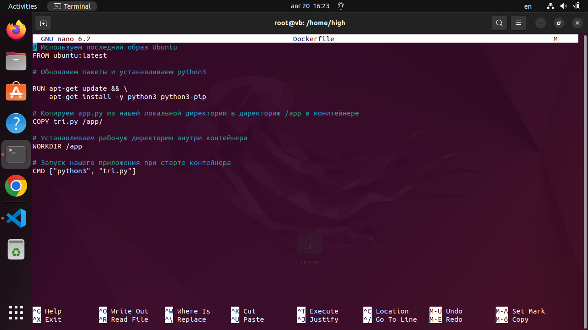

# Контейнеризация (семинар 04)

## Dockerfile и слои

Создание контейнера из образа системы ubuntu, и запуска в нем программы на python.

---

Пишем программу (вывод в консоль [треугольников Серпинского](https://ru.wikipedia.org/wiki/%D0%A2%D1%80%D0%B5%D1%83%D0%B3%D0%BE%D0%BB%D1%8C%D0%BD%D0%B8%D0%BA_%D0%A1%D0%B5%D1%80%D0%BF%D0%B8%D0%BD%D1%81%D0%BA%D0%BE%D0%B3%D0%BE "Wikipedia")):

```python
def sierpinski(n):
    d = ["*"]
    for i in range(n):
        sp = " " * (2 ** i)
        d = [sp+x+sp for x in d] + [x+" "+x for x in d]
    return d

print ("\n".join(sierpinski(5)))
```


---

Далее работаем под root.

Создаем Dockerfile:

``` docker   
# Используем последний образ Ubuntu
FROM ubuntu:latest

# Обновляем пакеты и устанавливаем python3
RUN apt-get update && \
    apt-get install -y python3 python3-pip

# Копируем приложение из нашей локальной директории в директорию /app в контейнере
COPY tri.py /app/

# Устанавливаем рабочую директорию внутри контейнера
WORKDIR /app

# Запуск нашего приложения при старте контейнера
CMD ["python3", "tri.py"]
```




---
Создаем контейнер:
```
docker build my-python-app
```


---
Запускаем контейнер:
```
docker run my-python-app
```


---
Список контейнеров в системе:
```
docker images
```


