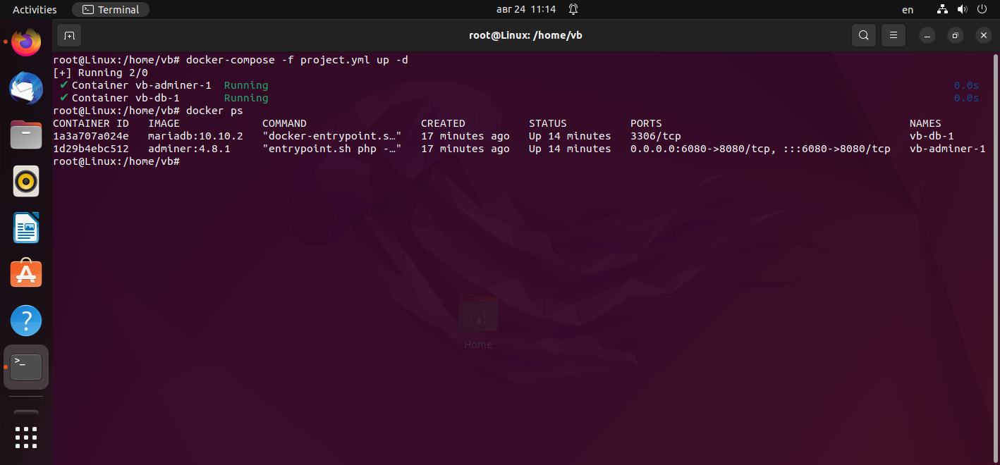
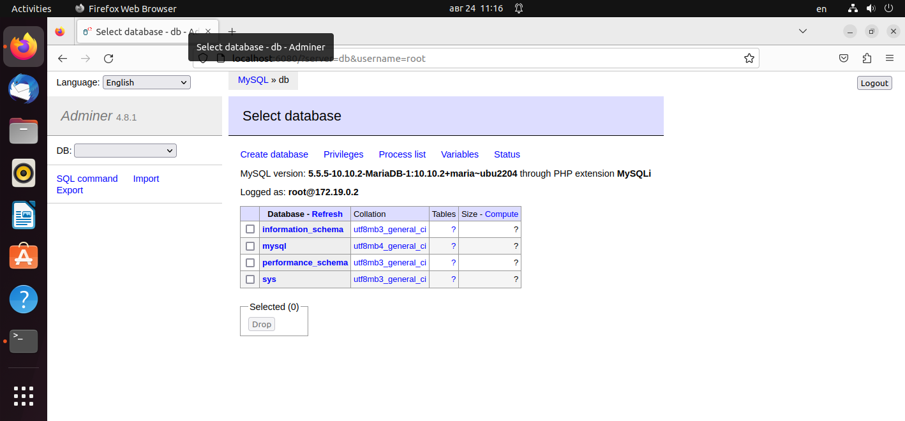

# Контейнеризация (семинар 05)

## Docker Compose и Docker Swarm

1) создать сервис, состоящий из 2 различных контейнеров: 1 - веб, 2 - БД (compose)
2) необходимо создать 3 сервиса в каждом окружении (dev, prod, lab)
3) по итогу на каждой ноде должно быть по 2 работающих контейнера
4) выводы зафиксировать

---
### Docker Compose
Создаем файл project.yml

`nano project.yml`

``` docker
version: ‘3.9’
services:
  db:
    image: mariadb:10.10.2
    restart: always
    environment:
      MYSQL_ROOT_PASSWORD: 12345

  adminer:
    image: adminer:4.8.1
    restart: always
    ports:
      - 6080:8080
```
Запускаем контейнер:

`docker-compose -f project.yml up -d`

(Здесь: ключ `-f` — указание на имя проекта (по умолчанию будет использован файл docker-compose.yml), ключ `-d` — запуск процесса в фоновом режиме, чтобы он не занял консоль)

Смотрим процессы:

`docker ps`



Проверяем работу в браузере:




Установка docker machine

```curl -L https://github.com/docker/machine/releases/download/v0.16.2/docker-machine-`uname -s`-`uname -m` >/tmp/docker-machine &&     chmod +x /tmp/docker-machine &&     sudo cp /tmp/docker-machine /usr/local/bin/docker-machine```

Установка virtualbox для docker machine

`apt update && apt upgrade && apt install virtualbox`


https://docs.docker.com/engine/install/ubuntu/
