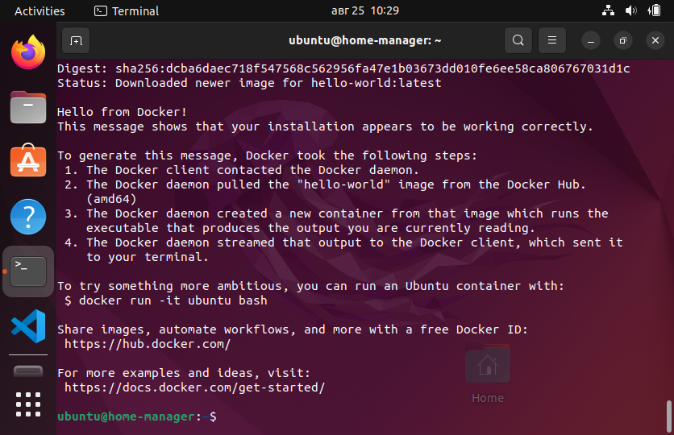
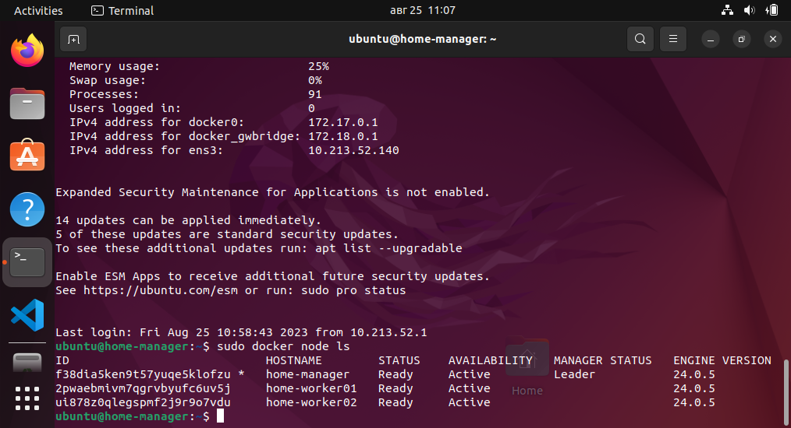
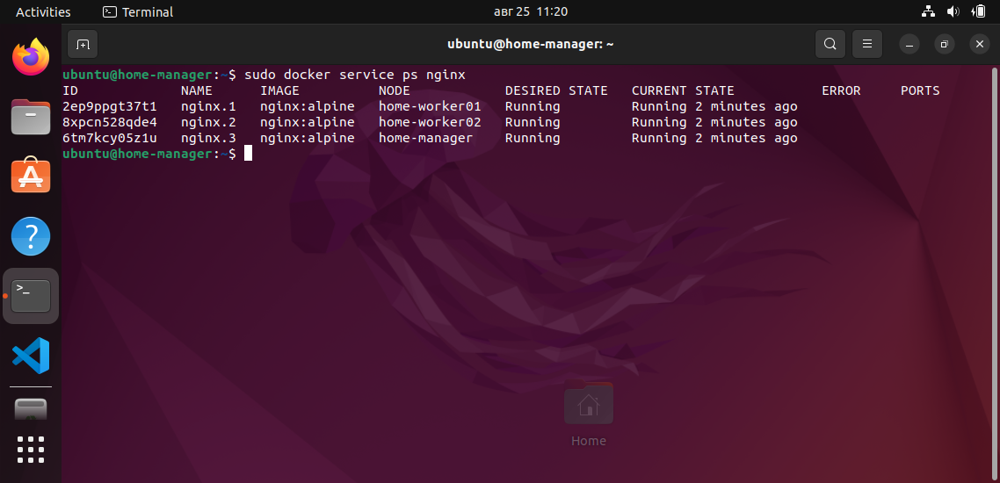
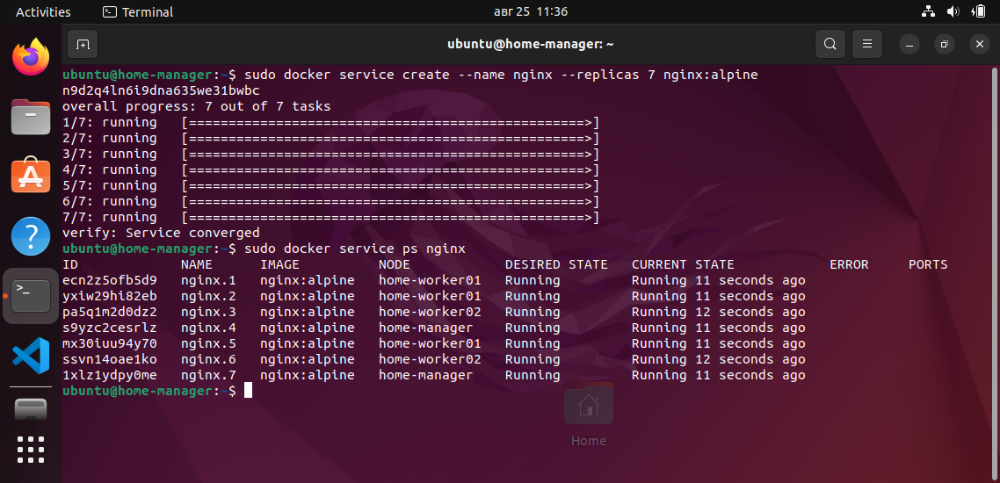

# Контейнеризация (семинар 05)

## Docker Compose и Docker Swarm

### Docker Compose
Создаем файл project.yml

`nano project.yml`

``` docker
version: "3.9"
services:
  db:
    image: mariadb:10.10.2
    restart: always
    environment:
      MYSQL_ROOT_PASSWORD: 12345

  adminer:
    image: adminer:4.8.1
    restart: always
    ports:
      - 6080:8080
```
Запускаем контейнер:

`docker-compose -f project.yml up -d`

Здесь: ключ `-f` — указание на имя проекта (по умолчанию будет использован файл docker-compose.yml), ключ `-d` — запуск процесса в фоновом режиме, чтобы он не занял консоль.

Смотрим процессы:

`docker ps`


Проверяем работу в браузере:


---
### Docker Swarm

К сожалению на виртуальной машине вообще не взлетела docker-machine, поэтому использую другой элемент.

Устанавливаем multipass с сайта
https://multipass.run

Запускаем машины для кластеризации

`multipass launch --name home-mananager`

`multipass launch --name home-worker01`

`multipass launch --name home-worker02`

Подключаемся к машине-manager

`multipass shell home-manager`

Ставим Docker

1. Удаляем все старые версии

`for pkg in docker.io docker-doc docker-compose podman-docker containerd runc; do sudo apt-get remove $pkg; done`

2. Обновляем список пакетов и разрешаем использование репозитория по HTTPS

`sudo apt-get update`

`sudo apt-get install ca-certificates curl gnupg`

3. Добавляем в систему GPG ключ Docker'а

`sudo install -m 0755 -d /etc/apt/keyrings`

`curl -fsSL https://download.docker.com/linux/ubuntu/gpg | sudo gpg --dearmor -o /etc/apt/keyrings/docker.gpg`

`sudo chmod a+r /etc/apt/keyrings/docker.gpg`

4. Добавляем репозиторий 

`echo \
  "deb [arch="$(dpkg --print-architecture)" signed-by=/etc/apt/keyrings/docker.gpg] https://download.docker.com/linux/ubuntu \
  "$(. /etc/os-release && echo "$VERSION_CODENAME")" stable" | \
  sudo tee /etc/apt/sources.list.d/docker.list > /dev/null`
  
5. Обновляем список пакетов
  
  `sudo apt-get update`
  
6. Устанавливаем последнюю версию Docker

  `sudo apt-get install docker-ce docker-ce-cli containerd.io docker-buildx-plugin docker-compose-plugin`
  
7. Проверяем установку

  `sudo docker run hello-world`
  


Также устанавливаем docker на остальные машины кластера.

Заходим на машину-manager, и выполняем команду

`sudo docker swarm init`

чтобы получить токен для подключения worker. Подключаем их, выполнив полученную команду на каждой машине.

Выполнив на машине-manager команду

`sudo docker node ls`

видим наш рой:



---

Для примера запустим три экземпляра сервера nginx под swarm. На машине-manager выполним команды:

`sudo docker service create --name nginx --replicas 3 nginx:alpine`

`sudo docker service ps nginx`

Получаем ожидаемый результат:



Или даже, удалив все сервисы командой

`sudo docker service rm nginx`

перезапустим их во множестве:

`sudo docker service create --name nginx --replicas 7 nginx:alpine`

И увидим, как ловко менеджер раскидал задачи



---

Кстати, для еще большего погружения в тему, крайне рекомендую статью «Docker Swarm для самых маленьких».
https://habr.com/ru/articles/659813/

Ну а пока: пока! .)